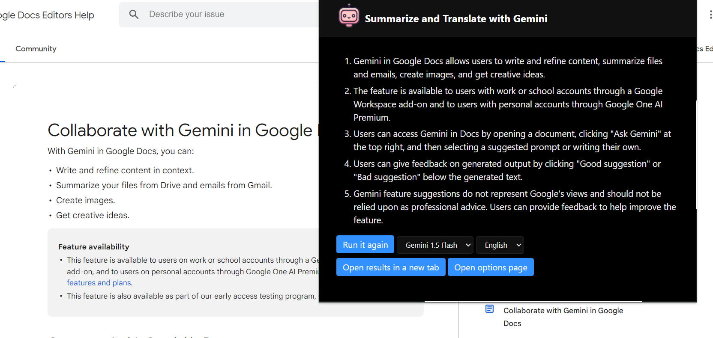
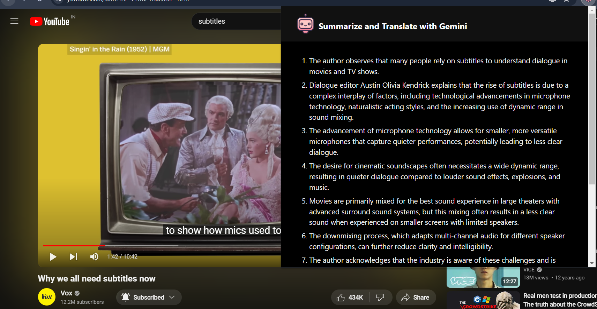
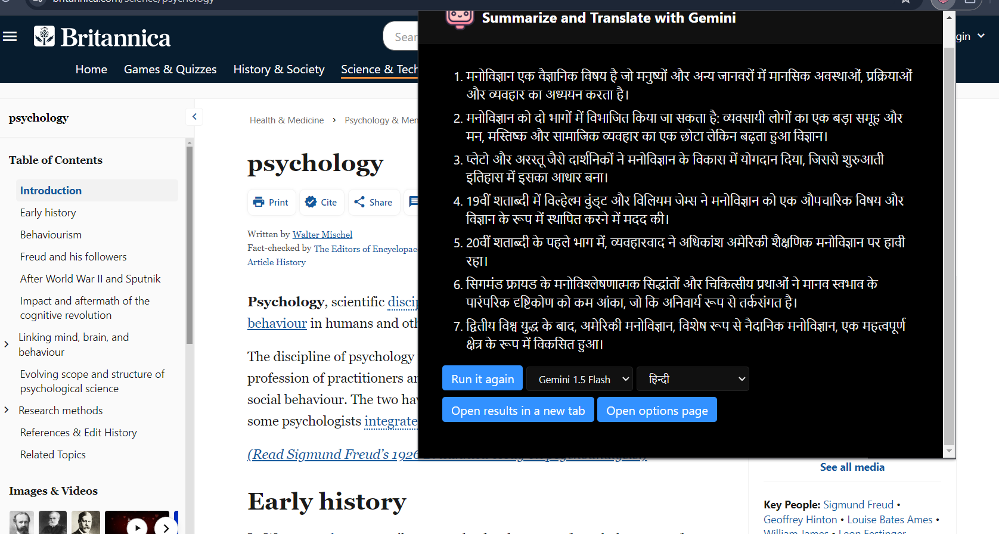

# webtube-ai

Chrome extension to summarize and translate web pages and youtube videos. Uses Gemini as the backend.

### Summarize

Simply open a web page and click on the extension icon to summarize its content.

If a YouTube video has captions, this extension will summarize the captions.

If you open an image file or a PDF file, this extension will summarize the currently displayed image.

### Translate

Select the text you want to translate and click on the extension icon.

